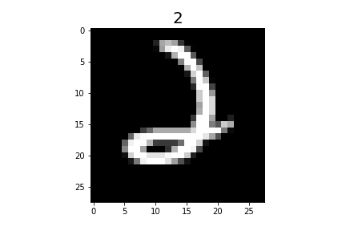
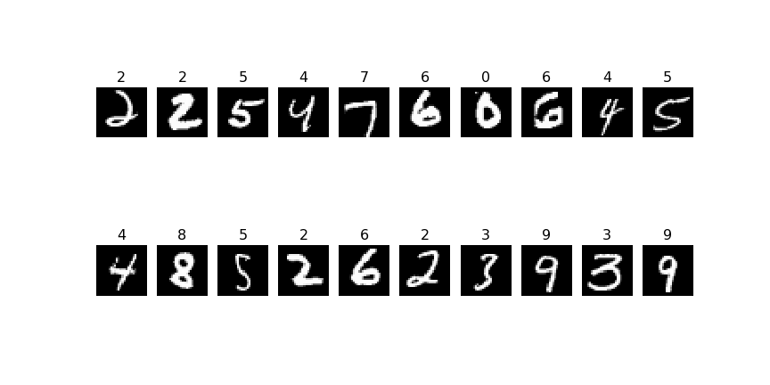
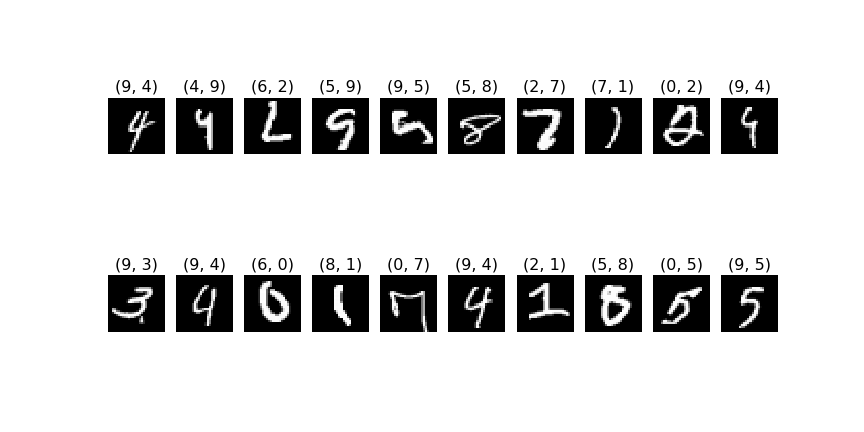
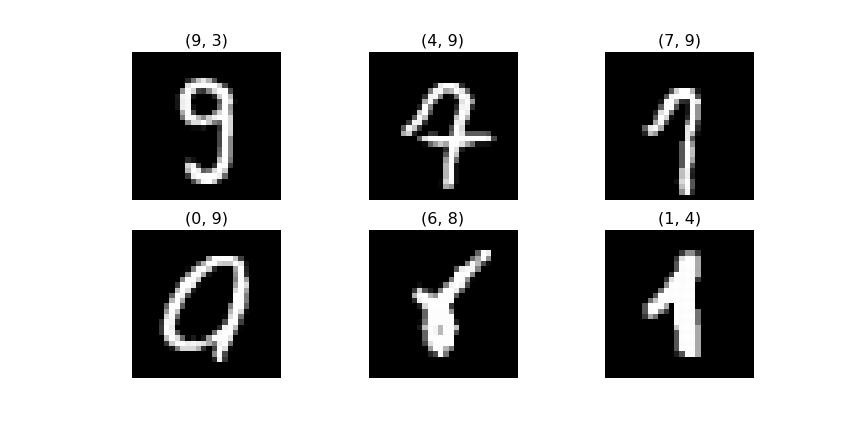

# Machine Learning for Handwritten Digit Recognition
Sharing my first Kaggle Subscription for [Digit Recognition with MNIST-Dataset](https://www.kaggle.com/c/digit-recognizer) using what I have learned on fast.ai machine learning course. I also explain a lot of the code in the [jupyter notebook](https://github.com/KonstantinHebenstreit/MNIST/blob/master/mnist_sgd.ipynb) itself.

## MNIST Dataset
Here is an example picture of the MNIST dataset with the related digit.


## Training a Neural Net

```python
from fastai.metrics import *
from fastai.model import *
from fastai.dataset import *

import torch.nn as nn
```

```python
u= 200
net = nn.Sequential(
    nn.Linear(28*28, u),
    nn.ReLU(),
    nn.Linear(u, u),
    nn.ReLU(),
    nn.Linear(u, u),
    nn.ReLU(),
    nn.Linear(u, 10),
    nn.LogSoftmax()
)
```
```python
loss=nn.NLLLoss()
metrics=[accuracy]
opt=optim.SGD(net.parameters(), 1e-2, momentum=0.9, weight_decay=1e-3)
fit(net, md, n_epochs=5, crit=loss, opt=opt, metrics=metrics)
```
```python
epoch      trn_loss   val_loss   accuracy                     
    0      0.206313   0.229348   0.925857  
    1      0.140446   0.122023   0.963                        
    2      0.096415   0.110355   0.966429                      
    3      0.077491   0.094182   0.972143                      
    4      0.066027   0.092965   0.971                         
```

## Predictions
Here are some sample the Predictions from the trained neural net


## Confusion Matrix of the results on the validation set
```python
cm = pd.DataFrame(np.zeros((10, 10)))
for i in range(len(preds)):
    cm.at[preds[i],y_valid[i]] +=1
```
<table border="1" class="dataframe">  <thead>    <tr style="text-align: right;">      <th></th>      <th>0</th>      <th>1</th>      <th>2</th>      <th>3</th>      <th>4</th>      <th>5</th>      <th>6</th>      <th>7</th>      <th>8</th>      <th>9</th>    </tr>  </thead>  <tbody>    <tr>      <th>0</th>      <td>708.0</td>      <td>0.0</td>      <td>4.0</td>      <td>2.0</td>      <td>1.0</td>      <td>3.0</td>      <td>3.0</td>      <td>1.0</td>      <td>0.0</td>      <td>4.0</td>    </tr>    <tr>      <th>1</th>      <td>0.0</td>      <td>770.0</td>      <td>0.0</td>      <td>2.0</td>      <td>2.0</td>      <td>0.0</td>      <td>2.0</td>      <td>1.0</td>      <td>2.0</td>      <td>0.0</td>    </tr>    <tr>      <th>2</th>      <td>0.0</td>      <td>1.0</td>      <td>650.0</td>      <td>7.0</td>      <td>0.0</td>      <td>1.0</td>      <td>0.0</td>      <td>5.0</td>      <td>1.0</td>      <td>1.0</td>    </tr>    <tr>      <th>3</th>      <td>0.0</td>      <td>0.0</td>      <td>5.0</td>      <td>694.0</td>      <td>0.0</td>      <td>2.0</td>      <td>0.0</td>      <td>0.0</td>      <td>2.0</td>      <td>0.0</td>    </tr>    <tr>      <th>4</th>      <td>0.0</td>      <td>0.0</td>      <td>0.0</td>      <td>0.0</td>      <td>673.0</td>      <td>0.0</td>      <td>2.0</td>      <td>0.0</td>      <td>0.0</td>      <td>8.0</td>    </tr>    <tr>      <th>5</th>      <td>0.0</td>      <td>0.0</td>      <td>1.0</td>      <td>8.0</td>      <td>0.0</td>      <td>575.0</td>      <td>1.0</td>      <td>1.0</td>      <td>3.0</td>      <td>3.0</td>    </tr>    <tr>      <th>6</th>      <td>6.0</td>      <td>2.0</td>      <td>1.0</td>      <td>0.0</td>      <td>4.0</td>      <td>5.0</td>      <td>703.0</td>      <td>0.0</td>      <td>1.0</td>      <td>0.0</td>    </tr>    <tr>      <th>7</th>      <td>0.0</td>      <td>2.0</td>      <td>2.0</td>      <td>3.0</td>      <td>0.0</td>      <td>0.0</td>      <td>0.0</td>      <td>703.0</td>      <td>0.0</td>      <td>4.0</td>    </tr>    <tr>      <th>8</th>      <td>1.0</td>      <td>5.0</td>      <td>7.0</td>      <td>8.0</td>      <td>6.0</td>      <td>6.0</td>      <td>0.0</td>      <td>3.0</td>      <td>678.0</td>      <td>4.0</td>    </tr>    <tr>      <th>9</th>      <td>1.0</td>      <td>1.0</td>      <td>1.0</td>      <td>5.0</td>      <td>19.0</td>      <td>8.0</td>      <td>0.0</td>      <td>5.0</td>      <td>0.0</td>      <td>657.0</td>    </tr>  </tbody></table>

## Analysing the false rated pictures
```python
plots(x_imgs[false_pics[:20]], 
    titles= [(i,j) for i, j in zip(preds[false_pics[:20]],y_valid[false_pics[:20]])])
```
The first number in the title is the predicted number, the second is the valid one


So there are a lot of pictures, which are clearly false rated by the neural net. But I'm looking through 
these pictures to see if all of them correct rated and solveable. I find some exeptions, so although a neural net can perform a lot better than my current one, I doubt it is possible to reach 100% accuracy.


## Score
The accuracy score of this neural net on Kaggle is 0.97628
